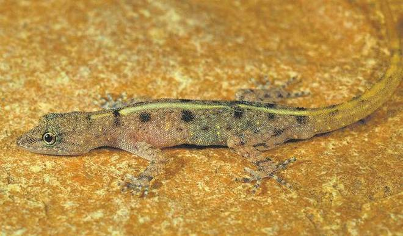

## New species of gecko found in the Eastern Ghats



### This is the twelfth species to be discovered outside the Western Ghats

A new species of lizard, the smallest known Indian gekkonid, has been discovered in the Eastern Ghats. Studies show that the species belonged to the genus Cnemaspis. In India, 45 diverse species of Cnemaspis have been found, of which 34 are from the Western Ghats.
The newly discovered dwarf gecko - Cnemaspis avasabinae  is the twelfth species to be discovered outside the Western Ghats and also the first species reported from the Velikonda Range in Andhra Pradesh. This discovery suggests that the genus may be even more widely distributed than previously thought.

“Cnemaspis is one of several groups of gecko that we now know are very diverse and widespread over much of peninsular India. Knowing this, we can survey in places that have not yet been studied, or have been understudied, and there is a good chance that new species can be found,” explains Aaron M. Bauer from Villanova University, U.S. in an email to The Hindu. He is one of the authors of the paper published in Zootaxa.

### Many species likely

“In the past, it was thought that there were only a few species, many of them relatively widespread, but now we recognise that it is likely that each hill range or isolated forest patch may have its own species. While we long knew that the diversity in the Western Ghats was high, only more recently have we come to recognise that the Eastern Ghats are also tremendously biodiverse,” he adds. The team gave it a common name – Sabin’s Nellore dwarf gecko.

The new species was sighted in a dry evergreen forest among the rocks beneath a small stream at a height of less than 200 metres above sea level and measured less than 2.9 cm (snout to vent length).

The dorsal colour of the head, body and tail of the reptile is grey-pink with six pairs of dark brown patches.

### Femoral's pores

The most interesting find was that the males of the species lacked femoral pores. Generally, most variants of lizards have femoral pores in both the sexes, and the secretions from these pores play a role in communication.

Prof. Bauer explains: “Lacking femoral pores doesn’t mean that a male gecko is not adequately supplied with chemical means of communication. It may also be possible that geckos are able to release pheromones to attract or communicate with possible mates, even if there are no pores. Pores may be especially useful for lizards that maintain a home range or territory and use them to mark this – to keep away other males even more than to attract females. Cnemaspis also have good vision, so visual signalling may play a part in mate attraction in these geckos.”

### More work needed

The team notes that more work is needed in the surrounding areas to determine how widespread it is. “But for now we would have to consider the species ‘data deficient’ until we know more and can meaningfully assess its conservation status,” adds Prof. Bauer.

## Vocabulary

 Word from the text | Synonym/definition in english | French translation
------------------- | ------------------------------ | -------------------
  widespread  |	           common               |	 répendu
      survey  	    |              look over           |  enquêter
    recognise  |            accept	            |  reconnaître
    supplied | provide | fourni
    

## Analysis

link of the article
[link](https://www.thehindu.com/sci-tech/science/new-species-of-gecko-found-in-the-eastern-ghats/article33201561.ece)

 word count: 532
 
analysis ask     | analysis answer
---------------- | -------------
Researchers?     | Aaron M./Prof. Bauer 
Published in? when (if mentioned)? | november 28, 2020 
General topic    | New species of gecko found in the Eastern Ghats (Sabin’s Nellore dwarf gecko)
Procedure/ what was examined | /
Conclusions/ discovery | A new speces of gecko is found (Sabin’s Nellore dwarf gecko)
Remaining questions |  More work is needed in the surrounding areas to determine how widespread the new spece is. 

```{r setup, include=FALSE}
knitr::opts_chunk$set(echo = FALSE)
```
