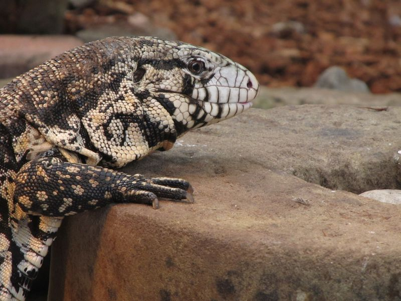

# These Four-Foot Lizards Will Eat Anything and They’re Invading the Southeastern U.S.


### Tegus first appeared in the wild of southern Florida a decade ago, but now they’re in Georgia and South Carolina, too
(Black-and-white tegus are more resistant to cold than most reptiles because they can raise their body temperature about 50 degrees Fahrenheit above that of the environment)

In Venezuela, the black-and-white tegu is known as el lobo pollero, or “the chicken wolf,” for its chicken coop heists, Rebecca Renner reports for National Geographic. The lizard will eat just about any fruit, vegetable or animal it can catch on ground-level, but eggs are its favorite.

Tegus are native to South America and their natural range spans from Venezuela in the north to Uruguay and Argentina in the south. But they’re also popular pets in North America, and over a decade ago they began to roam wild in southern Florida. Now they’ve been spotted around the southeastern U.S., and the race is on to catch the wild tegus before they establish a permanent population.

The large lizards will be tough to remove. They’re happy to chow down on unfamiliar food sources, and they’re more resilient to chilly climates than most reptiles.

“The hope would be eradication, but in all honesty, eradication is very, very difficult because you’re searching for an unknown end point,” says Georgia Southern University herpetologist Lance McBrayer to Discover’s Geoffrey Giller. “You have no idea when all of them would be gone — so when do you stop and call it?”

Tegus are easy to recognize because they have a distinctive black-and-white pattern of spots and stripes, so Georgia’s Department of Natural Resources put out a call for citizens to report sightings in May, Johnny Diaz reported for the New York Times in May. Local wildlife like quail, turkeys, alligators and the Georgia state reptile, the gopher tortoise, are all at risk because of the tegu’s appetite for eggs.
The tortoises, which are a threatened species, face a second risk because tegus have a habit of stealing other animals’ burrows for the winter. “They may displace gopher tortoises in doing so,” said Georgia Department of Natural Resources biologist John Jensen to the New York Times.
When it gets cold, tegus can raise their body temperature up to 50 degrees above the ambient temperature, but if they’re still cold, they burrow and bromate, which is the reptile version of hibernation, reports National Geographic.

There is no current estimate of how many wild tegus live in the U.S., but “the entire southeast portion of the United States is at risk. Much of this area has a climate that is suitable for tegus,” U.S. Geological Survey biologist Amy Yackel Adams tells National Geographic.
Most of the tegus captured in Georgia so far have been about two feet long. Last year, the state’s tegu-capturing program found about a dozen wild tegus, and this year they’ve found half that. McBrayer tells Discover that while the state hasn’t yet captured a juvenile tegu, they suspect that the population has started breeding. That would make eradication efforts all the more difficult.

The best chance to stop a species from settling down in a new habitat is early in its invasion. Adams tells Discover that she can only think of one example of a successful eradication effort, when she helped remove invasive chameleons in Maui. In the southeastern U.S., she thinks there’s another chance for success.

“We’re at that early invasion,” she says to Discover. “It’s the best time to deal with it.”

The first black-and-white tegus probably wound up in Florida’s wilderness because people bought them as pets, and then either released them or let them escape. Tegus are popular exotic pets, but some states like Alabama have barred new tegu imports to try to prevent invasive populations from cropping up there. In addition to the Georgia tegus, the lizards have been spotted in four South Carolina counties, and isolated tegus have been seen in Alabama, Louisiana, Texas, and across Florida, reports National Geographic.

In Georgia, wild tegus captured by the state are given to people who want them as pets.

“We do everything we can to get the animal, capture it, and try to rehome it,” says Georgia Reptile Society president Justyne Lobello National Geographic. “We want to help take them out of the habitat as humanely as possible. It helps that we have a long waiting list of people who want one as a pet.”

November 19, 2020

## Vocabulary

 Word from the text | Synonym/definition in english | French translation
------------------- | ------------------------------|-------------------
   to raise       |	               elevate           |	 élever
        heist	    |           holdup              |  braquage
     	   chow down       |            	 eat up           |  dévorer
     	    burrow |      tunnel        |terrier
     	    

## Analysis

link of the article
[link](https://www.smithsonianmag.com/smart-news/these-four-foot-lizards-will-eat-anything-and-theyre-invading-southeastern-us-180976350/?spMailingID=43945578&spJobID=1881605073&spReportId=MTg4MTYwNTA3MwS2&page=2&spUserID=MTA2MTUwMTExMjQ5NAS2)

 word count: 742
 
analysis ask     | analysis answer
---------------- | -------------
Researchers?     | Lance McBrayer/Amy Yackel 
Published in? when (if mentioned)? | November 19, 2020
General topic    | Lizards (Tegus) Who Eat Anything and They’re Invading the Southeastern U.S.
Procedure/ what was examined |1) the tegus who eat anythings. 2) Georgia’s Department of Natural Resources put out a call for citizens to report sightings about the number of tegus in May
Conclusions/ discovery | 1)the entire southeast portion of the United States is at risk. Much of this area has a climate that is suitable for tegus. 2)Tegus come probably from peoplewho bought them as pets
Remaining questions | Georgia is still trying to expel and relocate the tegus.

```{r setup, include=FALSE}
knitr::opts_chunk$set(echo = FALSE)
```

