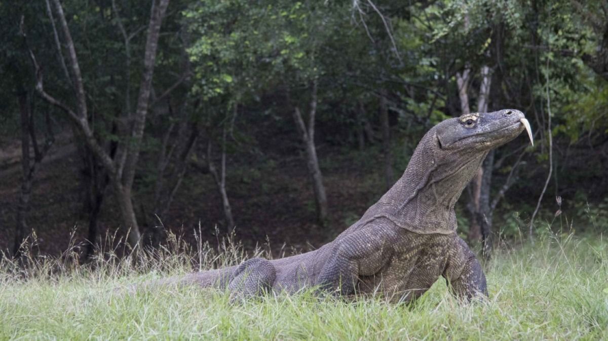

# STUDY REVEALS SURPRISING HISTORY OF WORLD’S LARGEST LIZARD


(komodo dragon. image: DR Damien Esquerré,ANU)


The unusual breeding history of the Earth's largest living lizard - the Komodo dragon - has been laid bare in a new study from The Australian National University. 
The Komodo dragon is best known for its size and hunting skills, reaching up to three metres long and preying on buffaloes, deer, and even the occasional human. But that's not all that sets it apart. 
The new study shows despite famously making its home in Indonesia, the Komodo dragon likely originated in Australia, as predicted by earlier fossil findings. While here it reproduced with a different species of lizard - an ancestor of the sand monitor, a type of goanna. 
Lead author of the study, Mr Carlos Pavón Vázquez said it's the first clear evidence of this type of interbreeding, known as hybridisation, happening in wild monitor lizards. 
"This study proves hybridisation can have a long-lasting effect. In this case it happened millions of years ago, but the signs are still there in the sand monitors. They have more in common with the Komodo dragon than you'd expect," Mr Pavón Vázquez said. 
"Sand monitors only occur in Australia and southern New Guinea, whereas the Komodo dragon is only found on a handful of islands in Indonesia. For them to have inter-bred they must have lived together some time in the past. 
"Our data supports the theory that Komodo dragons originated in Australia and then crossed over to Indonesia before becoming extinct here." 
Mr Pavón Vázquez said along with previous fossil evidence from Queensland, it shakes up what we know about the Komodo dragons' biology. 
"Previously it was assumed the Komodo dragon was a good example of what biologists call the island rule - with smaller animals growing larger in an island environment. But our findings offer more strong evidence the Komodo dragon was already huge when it originated in Australia," he said.  
"We also showed how to use different kinds of data to detect hybridisation. This is crucial because when it took place millions of years ago it can be hard to detect. Now we can tell by looking at the animal's morphology and genes." 
Mr Pavón Vázquez said the more we know about the biology of the Komodo dragon the better we'll be able to protect it from future threats - both human and environmental.  
The research is published in the journal Systematic Biology.

## Vocabulary

 Word from the text | Synonym/definition in english | French translation
------------------- | ------------------------------|-------------------
          |	                          |	 
       	    |                     | 
     	         |            	          |  
     	   |            |
     	    

## Analysis

link of the article
[link](https://science.anu.edu.au/news-events/news/study-reveals-surprising-history-worlds-largest-lizard)

 word count: 403
 
analysis ask     | analysis answer
---------------- | -------------
Researchers?     | 
Published in? when (if mentioned)? | 
General topic    | 
Procedure/ what was examined |
Conclusions/ discovery | 
Remaining questions | 

```{r setup, include=FALSE}
knitr::opts_chunk$set(echo = FALSE)
```
