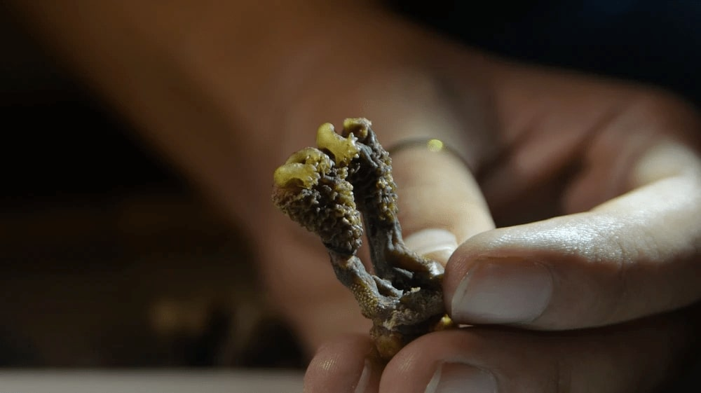

# Inside the Sad and Disgusting Black Market Trade in Monitor Lizard Penis


*MONITOR LIZARD PENIS CONFISCATED DURING A RAID. PHOTO COURTESY OF JOSE LOUIES/WTI*

Harvested in the most gruesome way and sold as “Himalayan mystical roots,” monitor lizard penises have found their way into the altars of many Indian homes.

Jose Louies, a wildlife conservationist in India, could not believe it when he heard about a new trade in male monitor lizards’ sex organs, which were being sold online as “mystical roots” from the Himalayas. That is, until his contact put a few lizard penises on the table.

“In my 15 years of fieldwork, this was a first,” says Louies, head of the Wildlife Crime Control Division of Wildlife Trust of India, recounting the events in the summer of 2017.  “I had not come across anything like this.”

The penises were being sold as Hatha Jodi, or “a pair of palms,” because a monitor lizard’s penis, when dried, resembles two clasped palms. These lizards, like certain other squamates, actually have two penises that are held inverted within the body and are extended only during erection. 

From there, Jose investigated the lead for the next six months. In the end, he discovered it was astrologers, mostly in central and western India, who were selling monitor lizard penises for between 1,000 and 3,000 Indian rupees ($14 and $40). According to popular claims, the mystical plant root could attract fortunes, suitable romantic matches and help to win lawsuits. The buyers, guided by faith and superstition, would anoint these organs with vermilion and keep them with idols of gods and goddesses in the altars in their homes. 

Per the Wildlife Protection Act of India, monitor lizards enjoy the same conservation status as tigers or elephants. But demand for their meat, skin, blood and penises is fuelling large-scale poaching. Jose confiscated some samples and sent them to labs to ensure that they were in fact monitor lizard penises. 

With enough evidence on him, he tipped off the Wildlife Crime Control Bureau, an Indian government body that combats wildlife crime. The bureau conducted 14 raids across the country in three months and recovered more than 300 Hatha Jodis. 

The most notable, Jose remembers, was a former customs officer-turned-astrologer on the outskirts of New Delhi who had 30 penises in his possession. Jose and his friend had approached the man posing as clients. “He called himself a fortune-teller and told me my aura was not good. He had no idea my aura was going to be very bad for him,” Jose says.

In another case, he encountered a biologist whose family had been worshipping a Hatha Jodi for 15 years. Jose’s team also found a bunch of 40 penises in the southern Indian state of Karnataka.
After about a year, Jose believes his team not only affected trade but also curbed demand by building awareness.

“I wouldn’t say it has ceased completely. The e-commerce sites have stopped facilitating the sale by banning the keyword. The last I heard was that a Hatha Jodi was sold for a whopping 50,000 Indian rupees ($690), a clear indication that the supply has come down,” he says.

Sumanth Bindumadhav, a senior manager of wildlife and disaster response at Humane Society International India, has been tracking the monitor lizard trade for over 11 years. “The trade has most likely gone underground,” he says. 

According to folklore, the lizard’s blood, meat and penis have medicinal properties, which transfer great physical strength and virility when eaten since the animal possesses incredible strength and grip. Legend has it that a great Indian warrior called Tanaji Malusare scaled a steep cliff during a battle using his pet monitor lizard for grip.

“All fake,” says Varad Giri, director of NIDUS, an environmental resource centre in the western Indian city of Pune, who has studied monitor lizards for over two decades. “Monitor lizards are like other lizards, only bigger in size. Their blood and other body parts are like any other reptile. There is nothing in their blood that gives it medicinal properties.”

The meat is served as a delicacy across eateries along the Indian highways, Sumanth says. 

An informer in the trade who requested anonymity says that many eateries sell cooked tails of cattle as monitor lizard meat when they can’t meet the demand.

The bushmeat is sold at 3,500 Indian rupees ($48) per kilogram while the blood is sold at more than 500 Indian rupees for 50ml. Oil costs 1,000 Indian rupees for 50 ml.

“The lizard doesn’t produce oil. This oil, a fake, is made by boiling mustard oil with some pain balm or quicklime which leaves a burning sensation when applied on the skin,” the informer says. 

Penises, on the other hand, are considered an aphrodisiac and are either cooked like meat or are dried and powdered for consumption.

According to the informer, the lizards are lured into a trap made using clutch or brake wires of vehicles with chicken waste. The reptiles then undergo a gruesome process through which their sex organs, the most traded of all organs, are extracted by burning their groin while they are still alive. The lizards are then bent backwards so the penis pops out which is then harvested using a sharp object.

Explaining the route of the trade, Sumanth says monitor lizards are trafficked through the eastern Indian state of Bihar, which shares a border with Nepal. From Nepal, they are transported to countries including China, Vietnam and some Southeast Asian countries and even Europe where it is popular as an exotic pet. “They are predators and they hunt, which is an entertainment for people,” Jose says.

“The lizard’s limbs and tails are often tied tightly at its back so they are easy to be stuffed in bags and backpacks,” says Sumanth, who has caught hundreds of live lizards traded in this manner. “They can stay without food for a few days. But in many cases, by the time we get to them, they would have lost a limb or two and are rendered unfit to go back into the wild,” he says. Then there is always the risk of them contracting some disease while being trafficked in packs which they could spread to other animals, and even humans. 

Jose says that in the absence of a stringent legal system, his job as a crime controller is to create unfavourable conditions for criminals. “To curb wildlife crimes, you need to be on your toes all the time.”


## Vocabulary

 Word from the text | Synonym/definition in english | French translation
------------------- | ------------------------------ | -------------------
      gruesome    |	             horrible             |	 horrible
       roots	    |          /           | racine
     	 monitor lizard         |            	  /        |  varan
     altars	   |       /     | autels
     
     	    

## Analysis

link of the article
[link](https://www.vice.com/en/article/m7ade4/inside-the-sad-and-disgusting-black-market-trade-in-monitor-lizard-penis)

 word count: 1050
 
analysis ask     | analysis answer
---------------- | -------------
Researchers?     | Jose Louies
Published in? when (if mentioned)? | /
General topic    | lizard penis black market
Procedure/ what was examined | How Jose Louies contributed reduce the lizard penis black market
Conclusions/ discovery | there is still lizard penis black market but it is significantly lower compared to before
Remaining questions | /

```{r setup, include=FALSE}
knitr::opts_chunk$set(echo = FALSE)
```

