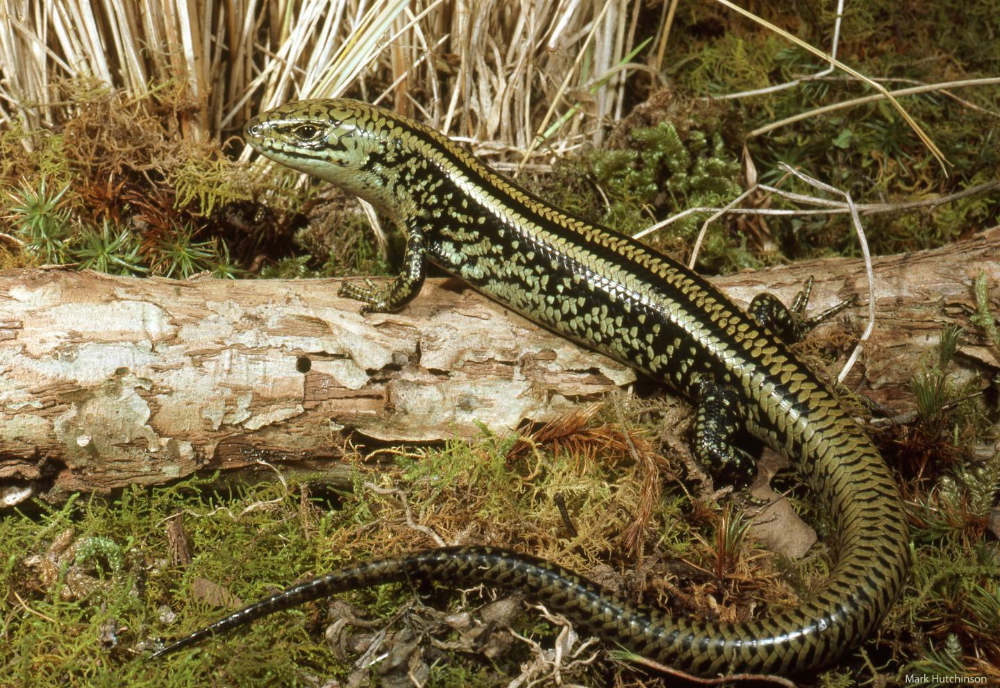

# New Australian fossil lizard



*SWAMP SKINK (LISSOLEPIS COVENTRYI), WHICH IS PROBABLY THE LIVING LIZARD MOST SIMILAR TO THE NEW FOSSIL. PHOTO: DR MARK HUTCHINSON, SA MUSEUM / FLINDERS UNIVERSITY, A CO-AUTHOR.*

Some of Australia's most famous animals - wombat, platypus, kangaroos and the extinct marsupial tiger thylacine - have been traced back to their fossil ancestors in remarkable finds in central South Australia.

Now a remote expedition to a large inland salt lake in 2017 has sifted through remains unearthed in Namba Formation deposits to describe a tiny new skink, an ancestor of Australia's well-known bluetongue lizards - to be named in honour of world-renown Flinders University lizard researcher Professor Mike Bull.

The new species, unveiled in the Royal Society's Open Science today, is described as Australia's oldest - a 25 million-year-old skink named Proegernia mikebulli after the late Flinders University Professor Mike Bull.

It was found by Flinders University and South Australian Museum palaeontologists and volunteers at a rich fossil site on Lake Pinpa located on the 602,000 square hectare Frome Downs Station, seven hours drive north of capital city Adelaide.

Following the crusted shoreline of a salt lake, the team homed in on a cross section of sediments where fossil excavations of ancestors of koala, a predatory bird, and fragments of a thylacine were previously unearthed. Remains of prehistoric fish, platypus, dolphins and crocodilians have also been found nearby.

"It was 45?C in the shade that day and hard work digging through the clay, but it was definitely worth it once the tiniest of bone fragments turned out to be those of the oldest Australian skink," says lead author palaeo-herpetologist Dr Kailah Thorn, who conducted the research at Flinders University as part of her PhD.

The once-verdant interior of Australia is considered the cradle of Australia's unique fauna and in particular its reptile diversity.

"Fossil lizards are often too small to be identified when you're in the field. Lizard skulls are made of more than 20 individual bones that all disarticulate when they fossilise," says Dr Thorn, who now works as curator of the Edward de Courcy Clarke Earth Sciences Museum at the University of Western Australia.

The discovery of the tiny fossil lizards in an area the size of one million soccer fields was enabled by building an understanding of the geology of the region, and targeting fossiliferous bands of silt to thoroughly sieve and sort back at the lab, she explains.

"These lizard fossils owe their discovery to the patient sorting of tiny bones," says lead author, vertebrate palaeontologist Flinders University Associate Professor Trevor Worthy. "A teaspoon holds hundreds of tiny bones - all revealed in translucent splendour under a microscope."

"Once every 30 spoons something else is found among the fish - usually a tiny mammal tooth. But the 2017 discovery of the oldest skink was a golden moment for a palaentologist," he says.

When researchers placed the fossil in the evolutionary tree of lizards, it was found to be an early member of the Australian skink subfamily Egerniinae - the group now encompassing bluetongues, sleepy lizards (shinglebacks), land mullets and spiny-tailed skinks.

The newly described lizard Proegernia mikebulli is named after the late Flinders University Professor Mike Bull, who passed away suddenly in late 2016.

Inspired generations of Australian herpetologists, Professor Bull's wide-ranging research career centred on social skinks from the Egerniinae subfamily, their behaviour, parasites, and conservation.

"Our colleague Professor Bull's long-term ecological studies of sleepy lizards were a massive contribution to biology," says co-author Matthew Flinders Professor Mike Lee (Flinders University / SA Museum).

"The fossil record is essentially data from a long-term natural ecological study, so its fitting that this fossil lizards is named after in honour of Mike."

## Vocabulary

 Word from the text | Synonym/definition in english | French translation
------------------- | ------------------------------|-------------------
          |	                          |	 
       	    |                     | 
     	         |            	          |  
     	   |            |
     	    

## Analysis

link of the article
[link](https://www.eurekalert.org/pub_releases/2021-02/fu-naf021521.php)

 word count: 600
 
analysis ask     | analysis answer
---------------- | -------------
Researchers?     |  Flinders University and South Australian Museum palaeontologists and volunteers 
Published in? when (if mentioned)? | Royal Society's Open Science Feb. 16th 2021
General topic    | New lizard fossil discovered (oldest skink lizard)
Procedure/ what was examined | A rich fossil site on Lake Pinpa on a cross section of sediments was searched
Conclusions/ discovery | discovery of an new fossil spieces of lizard "Proegernia mikebulli"
Remaining questions | /

```{r setup, include=FALSE}
knitr::opts_chunk$set(echo = FALSE)
```
