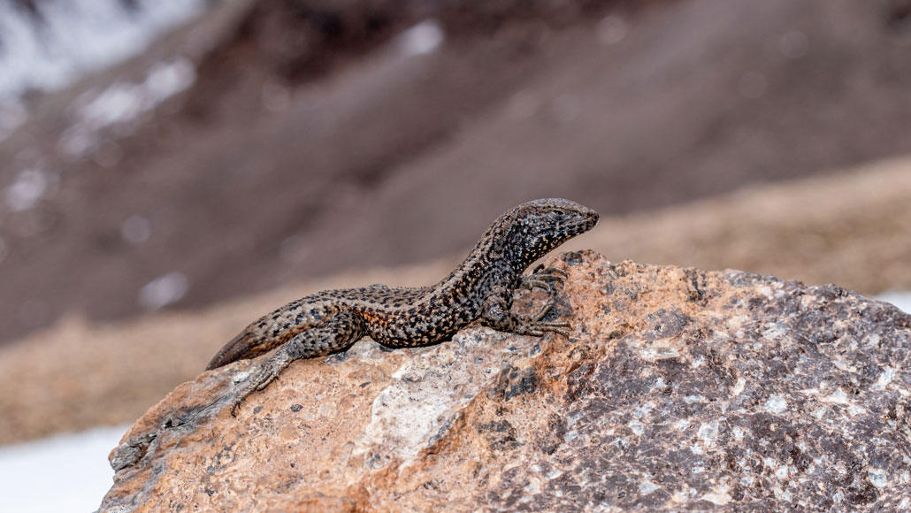

## A mountain lizard in Peru broke the reptilian altitude record

*A Liolaemus lizard was photographed at 5,400 meters above sea level*



*(The lizard Liolaemus tacnae (pictured) is native to the high Andes of Peru, where it’s recently been spotted setting a world altitude record for reptiles.AARÓN J. QUIROZ)*

High in the Peruvian Andes, a lizard has claimed the title of world’s highest altitude reptile. The lizard was spotted as high as 5,400 meters in elevation, exposed to frigid temperatures, intense ultraviolet radiation and low oxygen, researchers report February 15 in Herpetozoa.

In October 2020, zoologist José Cerdeña and colleagues ascended Peru’s Chachani volcano, which rises 6,057 meters above sea level. The team was looking for Liolaemus lizards, also known as tree iguanas, and found them as the researchers climbed above 5,000 meters. 

“We observed something moving between the rocks,” says Cerdeña, of the National University of Saint Augustine in Arequipa, Peru. “At first we thought they were mice.” After getting a closer look, he and his team saw that the darting animals were actually lizards, tentatively identified as Liolaemus tacnae. The species is known to survive at high altitude areas in Peru, and at least one population near Chachani was previously spotted some 4,000 meters above sea level.

Survival in such forbidding conditions is hard enough for mammals (SN: 7/29/20). But cold-blooded reptiles face additional temperature regulation obstacles, so records of reptiles this high are rare. Until now, the highest living reptile was a cold-hardy species of toad-headed agama lizard (Phrynocephalus erythrurus) living on the Tibetan Plateau at 5,300 meters. The Andean lizard breaks the old record by 100 meters. 

It’s somewhat fitting that the record goes to a species of Liolaemus lizard. The genus is exceptionally diverse, with more than 270 species adapted to a wide range of habitats all over South America.

Climate change could have facilitated Liolaemus’ status as a record holder, Cerdeña notes, as colder conditions have retreated up mountain peaks in the face of warming. “It is possible that this lizard species began to colonize this altitude recently,” he says.

The research group’s next steps are to verify the identification of the lizard with physical and genetic analysis, Cerdeña says. He also wants to know more about the reptile’s physiology, which may hold secrets to its high-altitude lifestyle.

## Vocabulary

 Word from the text | Synonym/definition in english | French translation
------------------- | ------------------------------ | -------------------
      tentatively     |	       provisionary               |	 provisoirement
        retreated up	    |           /              |  reculé


## Analysis

link of the article
[link](https://www.sciencenews.org/article/mountain-lizard-peru-broke-reptile-highest-altitude-record)

 word count: 365
 
analysis ask     | analysis answer
---------------- | -------------
Researchers?     | zoologist José Cerdeña and colleagues 
Published in? when (if mentioned)? | /
General topic    | the reptilian altitude record
Procedure/ what was examined | /
Conclusions/ discovery | the title of world’s highest altitude reptile  (5,400 meters in elevation) is awarded to a species of Liolaemus lizard
Remaining questions | Next steps are to verify the identification of the lizard with physical and genetic analysis


```{r setup, include=FALSE}
knitr::opts_chunk$set(echo = FALSE)
```


