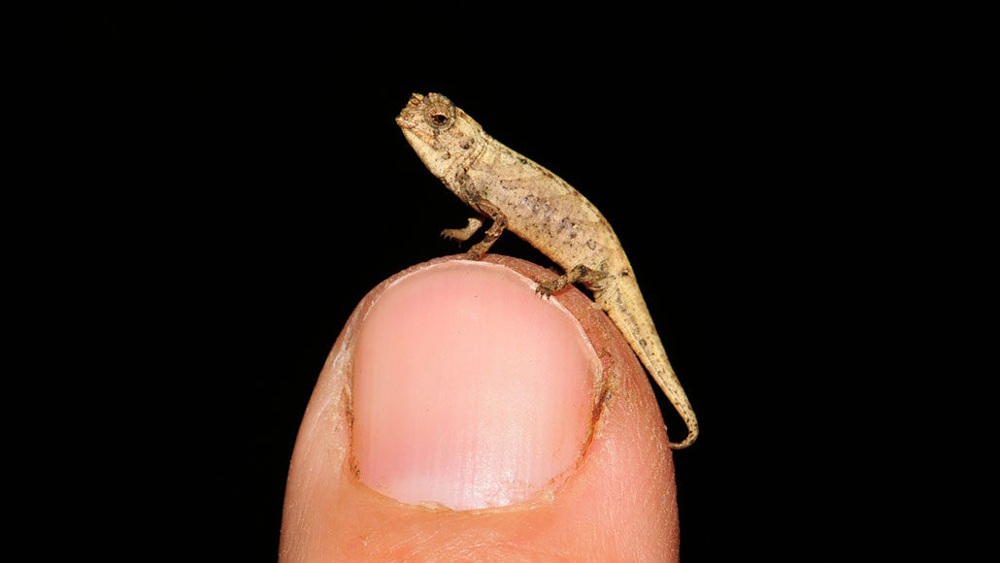

## A new chameleon species may be the world’s tiniest reptile

*But this fingertip-size critter in Madagascar also may be endangered with extinction*



A forest-dwelling chameleon easily hides beneath leaf litter in northern Madagascar. In fact, it is so slight it could tumble off the tip of your finger. The tiny critter is nearly 30 millimeters (1.2 inches) from snout to tail. It also might just be the smallest reptile on Earth,
Frank Glaw is a herpetologist at the Bavarian State Collection of Zoology in Munich, Germany. He was part of a team that described the animal January 28 in Scientific Reports.

No one knows how many of these chameleons exist. Scientists turned up just two, a male and female. The female measured 28.9 millimeters. She was 7.3 millimeters longer than the male.

The researchers dubbed the species B. nana for its nano size. The critter’s formal name is Brookesia nana. It belongs to a genus of at least 13 other small chameleons. All roam mountainous forests of northern Madagascar. By day, Brookesia chameleons scour the forest floor. They’re feeding on mites and other small invertebrates, Glaw’s team suspects. At night, the lizards retreat upward. They likely grip blades of grass or other plants for safety. 

Why B. nana and its cousins are so small remains a mystery. However, being tiny can have its benefits: There’s some evidence that small chameleons are especially good shots, using their ballistic tongues to catch prey. 

But the loss of forests and damage to other wild habitat may threaten the future of B. nana, the researchers worry. The good news: Madagascar’s government recently made the area where these compact chameleons live a protected area. In other efforts to protect B. nana, it may soon be listed as critically endangered with extinction. This rating is the gravest one issued by the International Union for Conservation of Nature.


## Vocabulary

 Word from the text | Synonym/definition in english | French translation
------------------- | ------------------------------ | -------------------
       snout     |	               nose              |	 museau
        dubbed 	    |           call              |  surnommé
          roam     |              stray           |  errer
       scour     |	               travel              |	 parcourir
       mites |	               /              |	 acariens
## Analysis

link of the article
[link](https://www.sciencenewsforstudents.org/article/new-tiny-chameleon-species-world-smallest-reptile)

 word count: 320
 
analysis ask     | analysis answer
---------------- | -------------
Researchers?     | Frank Glaw
Published in? when (if mentioned)? | January 28 in Scientific Reports.
General topic    | the smallest reptile on Earth
Procedure/ what was examined | A forest-dwelling chameleon *Brookesia nana*
Conclusions/ discovery | probably the smallest reptile on Earth
Remaining questions | Why B. nana and its cousins are so small remains a mystery. 


```{r setup, include=FALSE}
knitr::opts_chunk$set(echo = FALSE)
```
